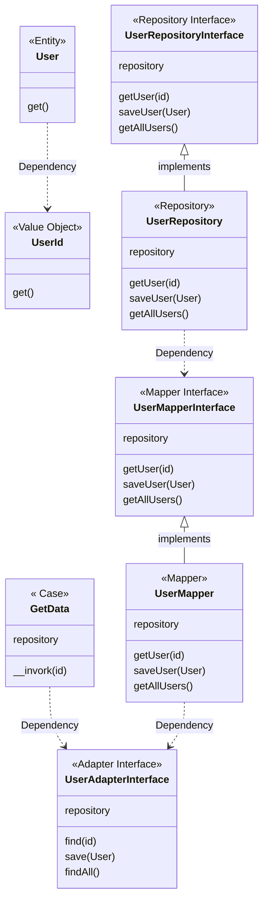

# Clean architecture example for php
This repository is learn about Clean Architecture (DDD) fro PHP.  
I implement 3 UseCase for user data.
* get user data
* get all user data
* save user data

### DB Schema
This code does not require a DB layer, but assumes a table like the one below.
User Table
|  No  |  column  |  data definition  |
| ---- | ---- | ---- |
|  1  |  id  |  int,PK  |
|  2  |  name  |  varchar  |
|  3  |  age  |  int  |
|  4  |  gender  |  int  |
|  5  |  mail  |  varchar  |
|  6  |  address  |  varchar  |

### Class Diagram
※※Under construction※※  
This diagram is for illustrative purposes.
    



# How to use fro dev

## install
```
git clone <this>  
cd learning-php-clean-architecture  
composer install --dev  
```

## code example
```PHP
<?php

namespace Sample;


use Src\Application\User\UseCase;
use Hoge\Eloquent;

class Example
{

    private $eloquent;

    public function __construct(Eloquent $eloquent)
    {
        $this->eloquent = $eloquent;
    }
    
    /**
     * @return void
     */
    public function exampleGetData(Request $request): void
    {
         $userId         = $request->input('userId');
 
         $useCase = new GetData($this->eloquent);
         $data     = $getDataUseCase($userId);
         
         return $data;
        
    }
}
```

# Licence
MIT
